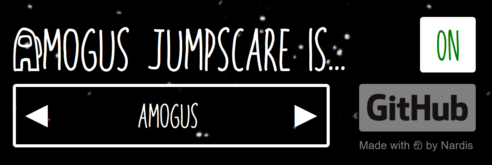
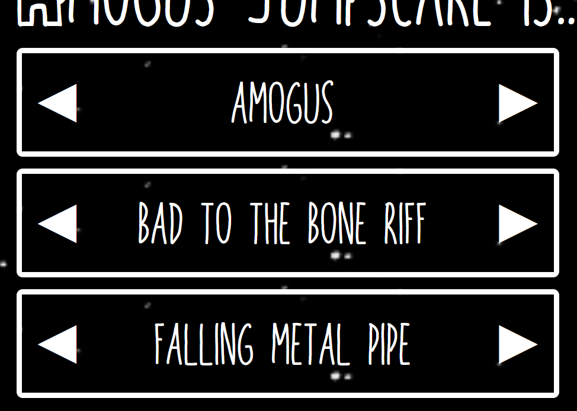

  

# Amogus Jumpscare
Dread it. Run from it.

Tired of enjoying a relaxing web browsing experience? This extension is just what you need!
As the name suggests, Amogus Jumpscare is a joke extension that randomly plays a funny and totally-not-overused sound effect, making your browsing session even more interesting.

## How to use it

  

When first installed, the extension is enabled by default. To disable it, click on the white toggle in the top-left corner of the pop-up.

Furthermore, you can click on the arrows to cicle through the three available sound effects:

  

Finally. the "GitHub" button redirects to page.

## Installation
The extension is already available on the [Mozilla add-ons store](https://addons.mozilla.org/it/firefox/addon/amogus-jumpscare/), while a version for Chromium is still coming. Stay tuned!

## Important Notes
On Firefox, you may need to allow audio autoplay for this extension to work properly.

Please do note that, by using this software, you acknowledge that amogus memes are still funny.
> <a href="https://www.flaticon.com/free-icons/speaker" title="speaker icons">Speaker icons created by Freepik - Flaticon</a>

## Licensing
Amogus Jumpscare is licensed under the MIT License. See [LICENSE](https://github.com/jazziNardis/Amogus-Jumpscare/blob/main/LICENSE) for the full text.
